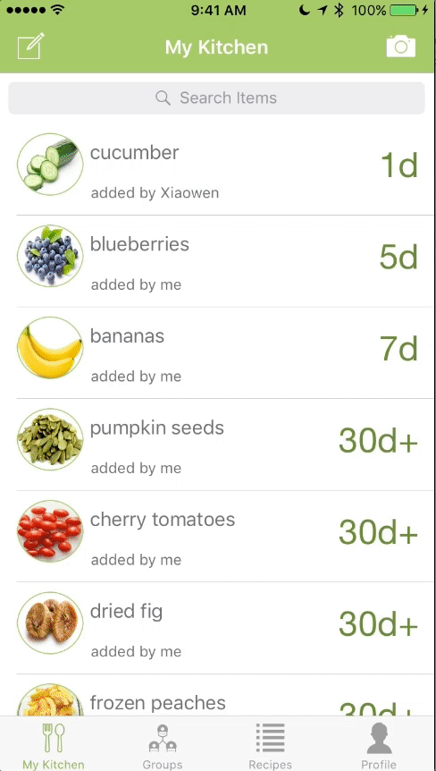

# FoodSavr
UW iSchool Capstone 2017

FoodSavr
======================

The repository contains FoodSavr, an iOS application that helps you keep track of food items in your kitchen by taking a picture of your grocery receipt. 

## Table of Contents

- [Main Features](#main-features)
- [Major Technology Decisions](#major-technology-decisions)
- [Team](#team)
- [Screenshots](#screenshots)

## Main Features
* Utilize text recognition to scan a receipt and load food items into the kitchen inventory on the app
* Manual input of an individual food item
* Prioritize food in your kitchen by expiration date
* Customize type of recipe recommendations by dietary restriction, preference or specific ingredients
* Recommended recipe for each food item
* Optimize as many food items in the kitchen for recommended recipe 
* Ability to create groups for sharing food items
* Share a food item among different groups

## Major Technology Decisions  
* We decided to use text-recognition/ receipt scanning to load food items, because it requires minual effort from users
* We chose Swift 3 as our main programming language because two of our developers have experience with it
* We chose Firebase as our back-end database because it has a free tier with well-written documentation and the ability to connect third-party authentication
* In order to process receipts and generate recipes in the background, several Firebase Cloud Functions are triggered to call the Yummly, Google URL Shortener, and OCRSpace APIs.
*  We chose Yummly because it allows recipe search by ingredient, and incorporates dietary preferences. It has a huge collection of over 1 million recipes.                                                                                      * We decided to use Facebook login for authentication because most people have an account already and it allows us to access an individual’s friends list, which is useful for the sharing feature

## Team
[Peter Freschi](https://github.com/pfreschi) | [Xiaowen Feng](https://github.com/xiaowenfeng1) | [Sophie Song](https://www.linkedin.com/in/yiyingsong/) | [Sayna Parsi](https://github.com/sainap)

## Screenshots

